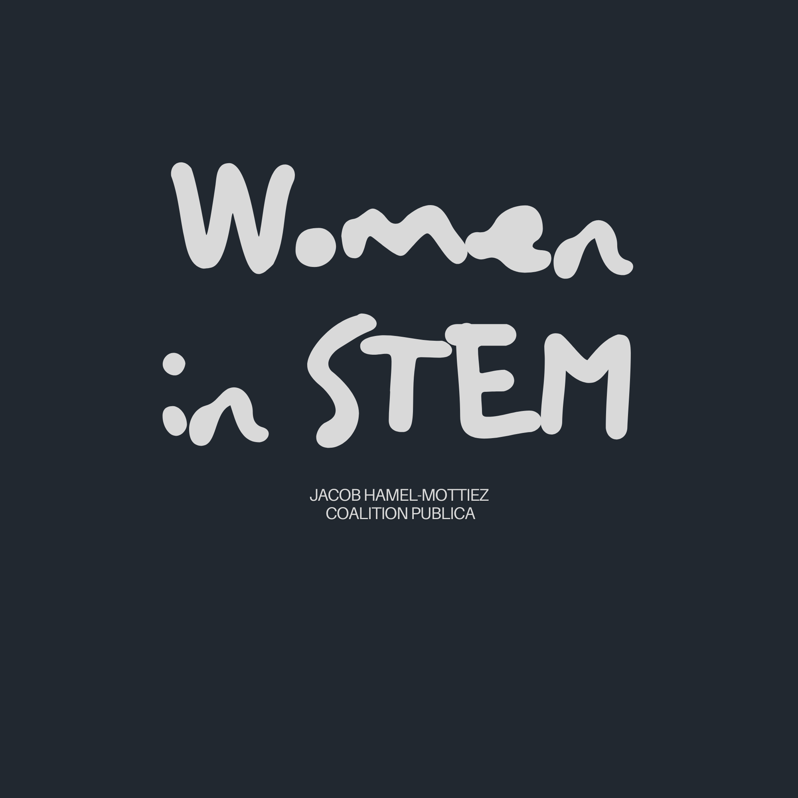

# Women_in_STEM
**BACKGROUND.** 
Historically, the university as an institution has largely been reserved for men. Quebec is no exception to this reality. Until the twentieth century, women were explicitly excluded from higher education (Conseil du statut de la femme, 2008). In the late 1970s, the Conseil du statut de la femme introduced its comprehensive policy on the status of women, *Pour les Québécoises : égalité et indépendance* (1978), which called, among other things, for greater representation of women and female role models within universities. **Despite this call, women remain underrepresented in several disciplines today, particularly in traditionally male-dominated fields such as science, technology, engineering, and mathematics (STEM)** (Carli et al., 2016; Chaire pour les femmes en sciences et en génie, 2022; Corbett, 2015). However, beyond changes in the number of women in STEM over time, little is known about their concrete scholarly output at the graduate level. Consequently, despite the importance placed on increasing the inclusion of women in STEM, as well as promoting an image of these disciplines in which women can see themselves reflected (Cheryan et al., 2017), no study has systematically documented the evolution of women's research topics in graduate studies at Quebec universities.

**OBJECTIVES.** 
The overall objective of this project is to provide a portrait of the evolution of women's research topics in graduate STEM studies in Quebec over the past four decades (1985–2025). To achieve this objective, three sub-objectives will be pursued. First, we will map the entire scholarly output of our corpus according to research themes (1). Second, we will identify the works authored by women within our corpus in order to conduct analyses specifically on this subset (2). Third, we will document the historical and institutional initiatives implemented to promote the inclusion of women in Quebec universities in order to better understand how these initiatives may have influenced the dynamics identified in the previous analyses (3).

